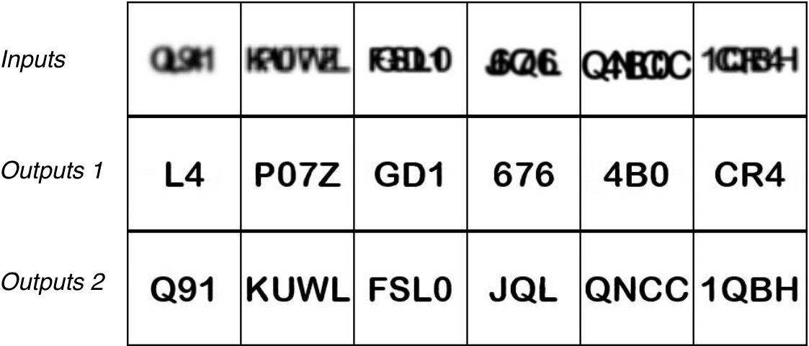

# text-decomposition
Decomposing overlapped texts. This is the code used for our paper _Near-Infrared Imaging for Information Embedding and Extraction with Layered Structures_ on ACM Transactions on Graphics.
 

This repository is a fork of [jiupinjia/Deep-adversarial-decomposition](https://github.com/jiupinjia/Deep-adversarial-decomposition). The source codes are modified for text decomposition. 
 

For system setup, please visit [NIRScanner-Plotter](https://github.com/HighTemplar-wjiang/NIRScanner-Plotter).
 

For wavelength selection algorithm, please visit [NIRScanner-Imaging](https://github.com/HighTemplar-wjiang/NIRScanner-Imaging).
 

## Quick start
### Generating dataset
Run _generate\_train\_data.py_. 

### Train model
Please refer to [jiupinjia/Deep-adversarial-decomposition](https://github.com/jiupinjia/Deep-adversarial-decomposition). 

### Sample data

